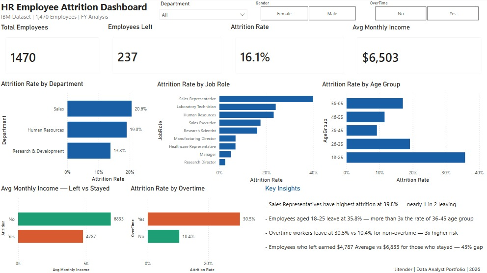

# HR Employee Attrition Analysis — Python + SQL + Power BI

**Project 3 of my Data Analyst Portfolio**

## Overview
Analysis of 1,470 employee records to identify key drivers of attrition using Python for EDA, SQL Server for validation and Power BI for dashboard reporting.

## Tools Used
- Python (pandas, matplotlib, seaborn) — data cleaning and exploratory analysis
- SQL Server (SSMS) — data validation and aggregation queries
- Power BI — interactive dashboard
- Google Colab — Python environment

## Dataset
- IBM HR Analytics Employee Attrition & Performance
- Source: Kaggle
- 1,470 employees | 35 columns (32 after cleaning)
- Link: https://www.kaggle.com/datasets/pavansubhasht/ibm-hr-analytics-attrition-dataset

## Key Metrics
| Metric | Value |
|---|---|
| Total Employees | 1,470 |
| Employees Left | 237 |
| Overall Attrition Rate | 16.1% |
| Avg Monthly Income (Stayed) | $6,833 |
| Avg Monthly Income (Left) | $4,787 |

## Key Insights
- Sales Representatives have the highest attrition at 39.8% — nearly 1 in 2 leaving
- Employees aged 18-25 leave at 35.8% — more than 3x the rate of 36-45 age group
- Overtime workers leave at 30.5% vs 10.4% for non-overtime workers — 3x higher risk
- Employees who left earned 43% less on average than those who stayed
- Sales department has highest attrition at 20.6%, R&D lowest at 13.8%

## Python Analysis
Data cleaning steps:
- Dropped 3 useless columns: EmployeeCount, Over18, StandardHours
- Created AgeGroup column using pd.cut() with 5 age buckets
- Exported clean dataset for SQL import

## DAX Measures
```
Total Employees = COUNTROWS(HR_Attrition)
Employees Left = CALCULATE(COUNTROWS(HR_Attrition), HR_Attrition[Attrition] = "Yes")
Attrition Rate = ROUND(DIVIDE([Employees Left], [Total Employees]) * 100, 1)
Avg Monthly Income = AVERAGE(HR_Attrition[MonthlyIncome])
Avg Years at Company = AVERAGE(HR_Attrition[YearsAtCompany])
```

## Dashboard Preview


## Author
Jitender | MIS Executive → Data Analyst
Data Analyst Portfolio | 2026
